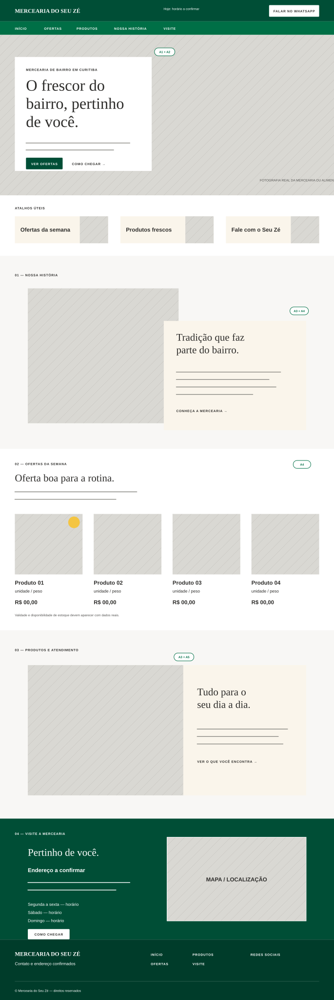

# Mercearia do Seu Zé

Cartão de visitas digital para uma mercearia de bairro em Curitiba, com foco em proximidade, confiança, produtos frescos e acesso rápido às informações que realmente ajudam o cliente: ofertas, horário, endereço, localização e WhatsApp.

**Site publicado:** https://lucasmd10.github.io/desafio-mercearia-seu-ze/

## Estado atual

**V2 — catálogo acadêmico e refinamento visual, na branch `v2`.**

HTML semântico, CSS responsivo e JavaScript modular, sem framework ou dependências de execução. A interface segue a paleta e a arquitetura aprovadas, com menu móvel, revelação progressiva, parallax discreto e movimento reduzido.

### Como executar

Requer Node.js 20.11 ou superior. Não é necessário instalar pacotes.

```sh
npm start
```

Abra http://localhost:3000. Para verificar as regras de conteúdo:

```sh
npm test
```

Também é possível servir a raiz com qualquer servidor estático. Não abrir por `file://`, pois o JavaScript usa módulos.

### Estado da entrega V2

- Branch `v2` preserva a V1 na `main`.
- Header desktop reorganizado: faixa de marca/endereço, identidade, horários e contato, navegação e progresso de leitura.
- Quatro ofertas com fotos geradas por IA em WebP, preços anteriores/atuais, categorias e filtros acessíveis.
- Novos detalhes editoriais, entrada escalonada, zoom discreto das fotos e navegação ativa; suporte a movimento reduzido preservado.
- Estrutura mobile da V1 preservada; apenas os novos componentes receberam adaptação.
- Cinco testes automatizados aprovados; sintaxe JavaScript e `git diff --check` aprovados.
- Validação visual/interativa da V2 pendente: navegador remoto bloqueou localhost.
- O Pages público ainda mostra a V1. O deploy da V2 [falhou antes das etapas](https://github.com/lucasMD10/desafio-mercearia-seu-ze/actions/runs/34962936842); a causa não foi confirmada pelos logs disponíveis. Conferir as anotações e as regras do ambiente `github-pages` antes de tentar publicar novamente.
- Workflow da V2 preparado para publicar pushes na branch `v2`; nenhuma regra de proteção foi alterada.

### Conteúdo da simulação

O endereço fornecido é **Av. Sete de Setembro, 82 — Curitiba, PR**, perto do Batel Grill.

Slogan: **O cuidado do bairro. O sabor de escolher bem.**

| Informação | Conteúdo acadêmico fictício |
|---|---|
| Segunda a sexta | 7h às 20h |
| Sábado | 7h às 18h |
| Domingo | 8h às 13h |
| Feriados | 8h às 14h |
| Telefone | (41) 3000-0000 |
| WhatsApp | (41) 90000-0000 |
| Instagram | @seuze.mercearia |
| Facebook | Mercearia do Seu Zé |

| Produto | Unidade | Preço de referência | Oferta |
|---|---|---|---|
| Pão de fermentação natural | 500 g | R$ 23,90 | R$ 18,90 |
| Morangos selecionados | 250 g | R$ 16,90 | R$ 12,90 |
| Queijo artesanal meia cura | 300 g | R$ 36,90 | R$ 29,90 |
| Café especial da casa | 250 g | R$ 39,90 | R$ 32,90 |

Produtos, preços, horários, números e perfis são inventados para apresentação acadêmica, não ofertas ou canais comerciais verificados. O rodapé identifica a simulação; botões de contato abrem um diálogo demonstrativo e não enviam mensagens nem acessam perfis possivelmente pertencentes a terceiros. Dados estruturados comerciais não são emitidos no modo acadêmico.

A vitrine usa `demoDate` (15/09/2026) e validade demonstrativa de 15 a 21/09/2026, mantendo os produtos visíveis para avaliação. Para uso comercial, substituir e verificar todos os dados, definir `academic: false`, atualizar datas e revisar links de contato/redes e dados estruturados.

### Imagens e versionamento

Imagens `pao.webp`, `morango.webp`, `queijo.webp` e `cafe.webp`, em `assets/images/`, foram geradas por IA: fotografia editorial quadrada de produto de mercearia premium, fundo creme, luz natural lateral, sem marcas ou texto. São ilustrativas, não fotografias do estabelecimento.

Commits da V2:
- `e25f21f` — catálogo acadêmico, dados da loja e quatro imagens de produtos.
- `818cd49` — header desktop, filtros, contato demonstrativo, motion e workflow da V2.
- Commit de fechamento — testes do catálogo e atualização deste README.

Os documentos de planejamento e implementação da V1 são históricos; as decisões de conteúdo acadêmico acima substituem a restrição original a dados comerciais confirmados.

## Objetivo do projeto

Criar uma página institucional completa, moderna e responsiva para colocar a Mercearia do Seu Zé no ambiente digital. A experiência deve funcionar como uma extensão da loja física: simples de entender, acolhedora, confiável e útil tanto para clientes antigos quanto para quem acabou de chegar ao bairro.

## Público-alvo

- Jovens adultos, universitários e novos moradores do Centro de Curitiba e bairros próximos.
- Filhos e netos de clientes tradicionais que procuram informações da loja pelo celular.
- Moradores da região que desejam consultar ofertas, horário, localização ou iniciar uma conversa no WhatsApp.

## Direção visual

A identidade combina duas referências com funções diferentes:

- [Whole Foods Market](https://www.wholefoodsmarket.com/): referência principal para cores, hierarquia tipográfica, distribuição dos conteúdos, uso de fotografias e alternância entre blocos editoriais.
- [Lune Croissanterie](https://lunecroissanterie.com/): referência de movimento, fluidez, ritmo de rolagem, revelação de textos e imagens e acabamento contemporâneo.

O resultado pretendido não é uma cópia dos sites. A página terá personalidade própria e adequada a uma mercearia brasileira de bairro.

### Paleta principal

| Papel | Cor | Uso previsto |
|---|---:|---|
| Verde institucional | `#004E36` | Cabeçalho, rodapé e grandes áreas de marca |
| Verde de ação | `#006F46` | Botões, links principais e estados ativos |
| Verde de apoio | `#2C8746` | Hover, detalhes e pequenos destaques |
| Creme quente | `#FAF5EB` | Seções editoriais e fundos acolhedores |
| Branco suave | `#F8F7F5` | Fundo geral e respiro visual |
| Branco | `#FFFFFF` | Painéis de conteúdo e contraste |
| Grafite | `#2E2D2B` | Textos principais |
| Cinza de apoio | `#565553` | Textos secundários e observações |
| Amarelo de oferta | `#F4C542` | Destaques promocionais pontuais, nunca como cor dominante |

### Tipografia proposta

- **Newsreader:** títulos editoriais, chamada principal e frases de marca.
- **Manrope:** navegação, parágrafos, preços, botões e informações práticas.

As duas são fontes abertas e cumprem papéis semelhantes às famílias serifada e sans-serif observadas nas referências.

## Estrutura planejada da página

1. Cabeçalho fixo com marca, navegação e acesso ao WhatsApp.
2. Hero fotográfico com painel editorial, apresentação curta e chamadas para ofertas e localização.
3. Faixa de atalhos úteis para ofertas, produtos frescos e contato.
4. Seção de história e proposta de valor em composição dividida entre texto e fotografia.
5. Ofertas da semana com produtos, preços, validade e aviso de disponibilidade.
6. Faixa editorial sobre produtos e atendimento de bairro.
7. Seção “Visite a mercearia” com endereço, horários e mapa.
8. Chamada final para WhatsApp.
9. Rodapé com navegação, contato e redes sociais.

## Regras que orientam o projeto

- Não usar emojis como ícones. A interface usará ícones SVG consistentes.
- Não criar KPIs, estatísticas ou cards sem função real.
- Não usar carrossel automático, vídeo de abertura, som ou loader que bloqueie o conteúdo.
- Priorizar leitura rápida, contraste, navegação por teclado e uso no celular.
- Usar animação como apoio à hierarquia, com alternativa para `prefers-reduced-motion`.
- Em produção, exibir somente dados confirmados; na V2 acadêmica, identificar explicitamente os dados fictícios.
- Manter ofertas com período de validade e aviso de disponibilidade de estoque.
- Direcionar o WhatsApp por link oficial com número sanitizado e mensagem inicial curta.
- Preservar consistência local de nome, endereço e telefone para SEO.

## Documentação

- [Planejamento detalhado](docs/PLANEJAMENTO.md)
- [Análise das referências visuais](docs/REFERENCIAS-VISUAIS.md)
- [Leitura e anotações dos wireframes](docs/WIREFRAME.md)
- [Wireframe desktop](docs/wireframe-desktop.svg)
- Wireframe mobile: descrito no documento de wireframes; SVG não disponibilizado nesta etapa.

### Prévia dos wireframes

#### Desktop



#### Mobile

Consulte as regras mobile em [WIREFRAME.md](docs/WIREFRAME.md).

## Estrutura do repositório

```text
assets/       # Imagem WebP e favicon SVG
src/data/     # Dados da loja, ofertas e modo acadêmico
src/scripts/  # Menu, conteúdo e movimento
src/styles/   # Tokens, base, layout, componentes, responsividade
scripts/      # Servidor local sem dependências
tests/        # Regras de conteúdo
docs/         # Planejamento, referências e implementação
index.html    # Página semântica
```

## Plano de execução

| Fase | Resultado | Estado |
|---|---|---|
| 1. Descoberta | Requisitos, referências e restrições consolidados | Concluída |
| 2. Planejamento | Arquitetura, identidade, conteúdo, movimento e regras | Concluída |
| 3. Wireframe | Versões desktop e mobile documentadas | Concluída |
| 4. Interface | HTML semântico e estrutura completa da página | Implementada |
| 5. Estilo | CSS responsivo, tokens visuais e componentes | Implementado; revisão visual pendente |
| 6. Interações | JavaScript progressivo e animações acessíveis | Implementadas |
| 7. Validação | Responsividade, acessibilidade, SEO e desempenho | Testes de regras aprovados; navegador pendente |
| 8. Entrega | Revisão final e publicação | GitHub Pages ativo; revisão de conteúdo pendente |

## Equipe

| Integrante | Informações disponíveis nesta fase |
|---|---|
| Lucas Marcondes | Engenharia de Software; desenvolvimento, Git/GitHub, dados e automação |
| Daniel | Apoio na análise e no GitHub; demais informações profissionais a confirmar |
| Joaquim | Informações profissionais e links a confirmar |
| Rafael | Informações profissionais e links a confirmar |
| Rafael Ribeiro | Informações profissionais e links a confirmar |
| Fábio | Informações profissionais e links a confirmar |

Antes da entrega acadêmica, o mini currículo e os links profissionais de cada integrante deverão ser completados.

## Pendências para produção

- Confirmar dados comerciais, canais oficiais, horários e ofertas antes de retirar o modo acadêmico.
- Substituir imagens ilustrativas por fotografias autorizadas, se desejado.
- Completar informações profissionais e links dos integrantes.
- Resolver o deploy da V2 e validar desktop, teclado, filtros, diálogo e regressão mobile no site publicado.
- Executar auditoria de acessibilidade e desempenho; ainda não há resultado de Lighthouse.
